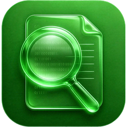

# AIGC Detector Toolkit

<p align="center">
  
</p>

> Free local AI-written ratio detection - dorm PCs can run it, your paper never leaves your computer, and the results stay in your hands.

> ⛔ **Commercial use prohibited**
> The source code is public, but **all commercial use is prohibited** — free for personal study,
> research and noncommercial organizations, under the
> [PolyForm Noncommercial License 1.0.0](LICENSE). For commercial use, contact the author for
> written permission first. See [License](#license).

<p align="center"><a href="README.md">中文</a> | <b>English</b></p>

## 📖 Start Here

- 👉 **[REPO_FILES.md](REPO_FILES.md)** — **what every file in this repo is for**, which ones must not be deleted, and how to run from source（[中文](仓库文件说明.md)）
- 📝 **[Changelog CHANGELOG.md](CHANGELOG.md)** — what changed in each version, with a **"visible to users"** note per release (中文: [更新日志.md](更新日志.md))
- ❓ Something not covered? See [Bug Reports](#bug-reports) at the end, just send an email

> **If you just want to install and use it, you need exactly one file — the one for your OS.** Ignore everything else.

## 📦 Download & Install

Builds for all three platforms live under Assets on the **[Releases page](https://github.com/Gx664/AIGC/releases/latest)**. Pick the one matching your OS:

| Your OS | Download this file | How to install |
|---|---|---|
| **Windows 10 / 11** | `AIGC_Toolkit_Setup.exe` (~22 MB) | Double-click → choose a folder → Install |
| **Linux (x86_64)** | `AIGC_Toolkit-x.y.z-x86_64.AppImage` (~88 MB) | `chmod +x`, then double-click (or run from a shell) |
| **macOS (Apple silicon)** | `AIGC_Toolkit-x.y.z-macos-arm64.dmg` (~62 MB) | Open the dmg → drag the app into Applications → **allow it once on first launch**, see below |

On first launch a setup window downloads the runtime components (~0.2 GB, fast CN mirrors, no VPN needed):
if you have an NVIDIA GPU it asks whether you want the CUDA or the CPU build; otherwise the CPU build is used. After that it runs fully offline.

> **Windows**: just double-click the desktop icon afterwards.
> **Linux / macOS**: components go into your **user directory** (Linux `~/.local/share/AIGC_Toolkit`, macOS `~/Library/Application Support/AIGC_Toolkit`) — nothing is written to system directories. To uninstall, delete the app plus that directory.

<details>
<summary><b>Linux users: two things to know</b></summary>

- The AppImage needs `libfuse2` (Ubuntu 22.04+: `sudo apt install libfuse2`).
  If you can't install it, this still works: `APPIMAGE_EXTRACT_AND_RUN=1 ./AIGC_Toolkit-*.AppImage`
- On first run it **copies the bundled runtime into your user directory** before installing dependencies —
  an AppImage is a read-only image and its mount point changes on every launch, so installing in place would be lost.
  A desktop entry is created automatically.
</details>

<details>
<summary><b>macOS users: unsigned build, Apple silicon only</b></summary>

This project has no Apple Developer certificate, so the build is **unsigned** and macOS blocks it on the
first launch. Allow it once and everything works normally afterwards.

**macOS 15 Sequoia / 26 Tahoe and newer — System Settings is the only way:**

1. Double-click `AIGC_Toolkit` in Applications; when the warning appears click **Done**
   (**never click "Move to Trash"**)
2. Open **System Settings → Privacy & Security** and scroll down to the **Security** section
3. Click **Open Anyway**, then confirm with your password or Touch ID
4. Launch it once more — from then on a normal double-click works

> ⚠️ The **Open Anyway** button only stays there for about **one hour** after the blocked launch.
> If it is missing, double-click the app again and go straight back to that pane.

**macOS 14 and earlier**: Control-click (or right-click) the app → **Open** → **Open** again.

**Works on every version** — just use Terminal:

```bash
xattr -dr com.apple.quarantine /Applications/AIGC_Toolkit.app
```

- Seeing "**AIGC_Toolkit is damaged and can't be opened. You should move it to the Trash**" is a
  **misleading** message caused by the unsigned build plus the download quarantine flag — the file is
  fine, just allow it as described above.
- Only the **Apple silicon (arm64)** build is published. On an Intel Mac, run from source — see [REPO_FILES.md](REPO_FILES.md).
</details>

> 💡 You can also run straight from source (`python app/main.py`) — see [REPO_FILES.md](REPO_FILES.md) ([中文](仓库文件说明.md)).

## ✨ Features

| Feature | What it does |
|---|---|
| **Whole-document AI ratio** | Drop in a PDF / DOCX / TXT paper and get the overall AI-generated percentage |
| **Paragraph-level pinpointing** | Per-paragraph AI probability, with the most suspicious paragraphs highlighted in red |
| **Detect → diagnose → rewrite loop** | Diagnoses 11 kinds of AI traces (paragraph-level JSON report), then rewrites deterministically via a "three-round protocol" — **de-AI-ing ≠ colloquializing**, formal academic register preserved |
| **Automatic rewriting** | Re-checks locally after each pass and keeps rewriting until the target AI ratio is reached |
| **7 detection engines** | SimpleAI Chinese (default), AIGC Chinese v3, GLTR perplexity, Fast-DetectGPT, DetectGPT, Binoculars, PAN ModernBERT (English) — or any HuggingFace model |
| **Models on demand** | No model is bundled; download only what you use, then work fully offline |
| **Benchmarks** | RAID / MGTBench built in: measure accuracy, false-positive rate and a per-generator breakdown on labelled samples; import official dataset subsets |
| **Fully offline** | All inference runs locally; your paper is never uploaded. After the one-time model download it works with no internet |
| **LAN compute pooling** | Auto-parallel across multiple GPUs; add your roommate's PC, tablet or phone on the LAN to the pool |
| **Custom model path** | Store models on any drive (e.g. D:) so they don't eat C: space; reinstalling keeps them |
| **Highly customizable** | Threshold, paragraph splitting, worker count and more; presets can be saved, exported and imported |
| **Bilingual** | The app UI and the installer both switch between 中文 / English |

## Introduction

A **fully local** AIGC detection desktop tool: drag in a paper (PDF / DOCX / TXT), choose a detection engine, and get the overall AI-written ratio plus a paragraph-level report.

- **Fully offline inference**: the detection model is downloaded once; your paper is never uploaded to any platform
- **Custom model storage path**: keep models on any drive (e.g. D:) so they don't eat C: space; reinstalling the app never deletes downloaded models
- **7 detection engines**: SimpleAI Chinese (default), AIGC Chinese v3, GLTR perplexity, Fast-DetectGPT, DetectGPT, Binoculars, PAN ModernBERT (English) — plus any custom HuggingFace model
- **Models downloaded on demand**: nothing is bundled; grab what you need and stay offline afterwards
- **Benchmarks**: RAID / MGTBench built in, so you can audit your own detection results (accuracy, false-positive rate, per-generator breakdown)
- **Highly customizable**: threshold, paragraph splitting, worker count and more; presets can be saved, exported and imported
- **Multi-device compute pooling**: automatic multi-GPU parallelism on one machine; add roommates' PCs, Pads and phones over LAN
- **Detect → Diagnose → Treat**: after detecting the AI ratio, a fully local rule
  engine diagnoses AI traces (paragraph-level JSON report), then applies
  deterministic rewriting that keeps the academic register
- **Bilingual UI**: the app and installer support one-click switching between 中文 / English
- **Free for personal use**: a paid API is reserved, but personal noncommercial use stays free forever; **any commercial use is prohibited**

## Detect → Diagnose → Treat (new in v1.1)

Detection is only the first step. This project merges the methodology of two MIT
open-source projects into a complete loop - **everything runs locally, with no
external AI calls**:

### Diagnosis (local rule engine)

Scans three groups of signals and outputs a **paragraph-level structured JSON report** (exportable):

| Group | What it covers |
|---|---|
| 9-dimension scan | template phrases, burstiness (sentence-length CV), paragraph symmetry, passive voice, nested numbers, colon lists, punctuation, **colloquial warning**, **em-dash density** (the last two are "over-rewriting" gates that protect academic register) |
| CNKI's 5 language patterns | predictable rhythm, uniform density, fixed term position, overlapping connectives, template-functional paragraphs |
| 11 deep AI patterns | significance inflation, synonym cycling, rule of three, copula avoidance, vague attribution, formulaic challenges, suspended analysis, generic conclusions, em-dash overuse, false ranges, paired contrast closures |

Each paragraph gets: risk level, matched patterns with evidence snippets,
sentence-level markers, and suggested actions.

### Treatment (three-round protocol, deterministic rewriting)

1. **Round 1 (subtraction)**: protect spans first (citations, figure/formula
   numbers, data/percentages/P-values, technical terms, quotations - **never
   touched**), then word-level replacements (Chinese AI high-frequency words,
   rotating variants), sentence restructuring, and breaking parallels/numbering;
2. **Round 2 (addition)**: rhythm engineering - deterministic long-sentence
   splitting (target CV ≈ 0.45); **never fabricates facts, data or references**;
3. **Round 3 (self-check)**: Anti-AI audit + register guard - any colloquial/online
   slang must be restored to formal academic language, at most one em-dash per
   paragraph, **register comes before change ratio**.

Four iron rules apply throughout: no full AI rewrite, >40% change only through
structural rewriting and template removal, deterministic replacements, and a
hard academic-register floor.

After detection, if the overall AI ratio exceeds the threshold you set (default
30%, adjustable), the app suggests entering the rewrite flow; you can also click
"Rewrite" at any time.

## Inspiration

This project was inspired by my **college-student friend**.

His graduation thesis had to be **re-checked for AI-written ratio again and again** - once per revision - while the official school service is limited and expensive. Hearing his complaints, it hit me: **there is always someone gaming in a dorm, and gaming PCs basically all have dedicated GPUs that can easily run local AI detection**; if one GPU is not enough, link roommates' computers with an Ethernet cable / LAN, or even add **Pads and phones** to the compute pool.

So this project was born: bringing thesis detection **back to local, free and controllable**.

## The 11 integrated methods (all implemented, not just cited)

This project does **not invent its own algorithms** - it implements the following **peer-reviewed** methods as runnable engines or benchmark modules, grouped into Detectors / Rewriters / Benchmarks. No model is bundled; download what you use.

### Detectors (7) - is this text AI-written?

| Project / Paper | How it is implemented here | Links |
|---|---|---|
| **SimpleAI / HC3** (default Chinese engine) | RoBERTa sequence classifier, per-paragraph AI probability; paper "How Close is ChatGPT to Human Experts?" | [arXiv](https://arxiv.org/abs/2301.07597) · [GitHub](https://github.com/Hello-SimpleAI/chatgpt-comparison-detection) |
| **GLTR** | Language-model perplexity: PPL ≤ low → 0.85, ≥ high → 0.15, linear in between; from MIT, NeurIPS 2019 | [arXiv](https://arxiv.org/abs/1906.04043) · [GitHub](https://github.com/HendrikStrobelt/GLTR) |
| **Fast-DetectGPT** | **Implemented per the paper's conditional probability curvature**: the scoring model samples its own perturbations x̃, then we compare `logP(x) − E[logP(x̃)]`; ICLR 2024 | [arXiv](https://arxiv.org/abs/2310.05130) · [GitHub](https://github.com/baoguangsheng/fast-detect-gpt) |
| **DetectGPT** | **Implemented per the paper's masked perturbation**: T5 refills randomly removed spans to build x̃, then we compare log-probability curvature; zero-shot, Stanford, ICML 2023 (Oral) | [arXiv](https://arxiv.org/abs/2301.11305) · [GitHub](https://github.com/ericmitchell/DetectGPT) |
| **Binoculars** | Cross-perplexity ratio of two same-tokenizer models, `B = logPPL_observer / crossPPL_performer`; lower B means more AI-like; ratio-based, no threshold tuning; ICML 2024 | [arXiv](https://arxiv.org/abs/2401.12070) · [GitHub](https://github.com/AHans30/Binoculars) |
| **AIGC Chinese v3** (new in v1.3.4) | Chinese BERT sequence classifier trained on an upgraded HC3 Chinese corpus; HuggingFace `yuchuantian/AIGC_detector_zhv3`, about 409 MB, Apache-2.0 | [HuggingFace](https://huggingface.co/yuchuantian/AIGC_detector_zhv3) |
| **PAN ModernBERT-large** (new in v1.3.4) | From the PAN 2026 evaluation (Team DACTYL); HuggingFace `ShantanuT01/vanguard-ai-text-detector`, about 1.58 GB, MIT, English text | [HuggingFace](https://huggingface.co/ShantanuT01/vanguard-ai-text-detector) |

### Rewriters (2) - diagnose & reduce, built-in rules, no model download

| Project | How it is implemented here | Links |
|---|---|---|
| **aigc-reduce** | The three-round rewrite protocol, implemented in full: 9-dimension scan + AI-frequent word table + colloquial blacklist + protected spans, deterministic rewriting with a register guard. Rules follow the detection principles of CNKI 3.0 / Wanfang / PaperPass / PaperPure | [GitHub](https://github.com/xiaofenggan01/aigc-reduce) |
| **cnki-aigc---skill** | CNKI's 5 language patterns (rhythm / density / term position / connective function / template blocks) as a paragraph-level diagnosis with structured JSON output; that method measured 20.6% → 10.1% | [GitHub](https://github.com/qingshanliuci/cnki-aigc---skill) |

### Benchmarks (2) - audit a detector

| Project / Paper | How it is implemented here | Links |
|---|---|---|
| **RAID** | A runnable benchmark module: accuracy, **false-positive rate** (human text flagged as AI), false-negative rate, and a per-generator breakdown; ACL 2024, 6M+ texts | [arXiv](https://arxiv.org/abs/2401.09985) · [ACL](https://aclanthology.org/2024.acl-long.674/) · [GitHub](https://github.com/liamdugan/raid) |
| **MGTBench** | Precision / recall / F1 over the same labelled set, so detectors can be compared head to head; the first detection benchmark framework for LLMs | [arXiv](https://arxiv.org/abs/2303.14822) · [GitHub](https://github.com/xinleihe/MGTBench) |

Both benchmarks can **import a subset of the official datasets** (CSV / JSONL) for real evaluation, and export a Markdown report.
The 15 built-in samples are a hand-written smoke test by the author - they are not an official score.

> Separately, the "deep AI patterns" list originates from Wikipedia's "Signs of AI writing" (WikiProject AI Cleanup), localized by aigc-reduce.
>
> Disclaimer: results depend on the model and text type. They are for self-checking only and are not the verdict of any authority - the official judgement of your school / journal always wins.

## Extending: swap models / add engines (no rebuild needed)

1. **Swap a model**: create `engines_catalog.json` in the install directory and override just the field you want - e.g. move Binoculars to the Falcon pair:
   ```json
   [{"id": "binoculars", "models": [{"repo": "tiiuae/falcon-7b"}, {"repo": "tiiuae/falcon-7b-instruct"}]}]
   ```
2. **Add an algorithm**: drop a `.py` into `engines_plugins/`, declare it with `@register("my_impl")` and implement `predict_paragraphs()` - it is discovered at startup.
3. **Remote list**: Engine manager → "Check for updates" → paste the URL of an `engines_manifest.json`; new engines / models arrive without upgrading the app.

## Special Thanks (Compute Pooling)

The "multi-device parallel detection" feature borrows ideas from these two open-source projects:

- **[exo](https://github.com/exo-explore/exo)** (exo-explore/exo, ~46k stars on GitHub): turns everyday devices (phones, Pads, laptops, gaming PCs) into a **P2P distributed AI cluster** with auto-discovery and dynamic model splitting, running large models on ordinary home hardware.
- **[llama.cpp](https://github.com/ggml-org/llama.cpp)** (ggml-org/llama.cpp): one of the most popular local LLM inference frameworks; its [RPC distributed inference](https://github.com/ggml-org/llama.cpp/tree/master/tools/rpc) splits model layers across heterogeneous devices (e.g. Mac Metal + NVIDIA CUDA), serving as the reference for our cross-device perplexity engines.

Thanks to those projects and their communities for making "dorm compute pooling" possible.

## Special Thanks (Diagnosis & Treatment)

The "Detect → Diagnose → Treat" loop directly merges the methodology of two MIT open-source projects:

- **[aigc-reduce](https://github.com/xiaofenggan01/aigc-reduce)** (xiaofenggan01/aigc-reduce): three-round protocol, replacement tables, Chinese AI high-frequency word lists, colloquial blacklist and 9-dimension scanning methodology. Our rewrite engine follows its rules exactly, insisting "de-AI-ing ≠ colloquializing", with the formal academic register as a hard floor.
- **[cnki-aigc---skill](https://github.com/qingshanliuci/cnki-aigc---skill)** (qingshanliuci/cnki-aigc---skill): a real-world method based on CNKI's "5 language patterns" (measured 20.6% -> 10.1%). Our diagnosis engine follows its patterns.

Thanks to both authors and their communities for making the full detect → diagnose → treat flow possible.

## Support & Donate

This project is completely free for personal use. If it helped you, you are welcome to **buy the author a milk tea** to support further development — or simply **share it with someone who needs it** / give it a ⭐ **Star**, which helps just as much.

> ⚠️ **Commercial use of this project is prohibited.** Personal study, research and exchange are free; for commercial use, please contact the author for written permission first.

<p align="center">
  
  
</p>

<p align="center">Alipay ｜ WeChat Pay</p>

You're also welcome to just drop a line to **gxgx3456@qq.com** or ping **@A9100010** on Telegram.

> 💬 **Feedback / suggestions / collaboration are all welcome - contact: gxgx3456@qq.com | Telegram: @A9100010**

### For international users

If you'd like to tip but don't use either of the two payment methods above, you can contact me on Telegram to send a tip instead - thank you!!!

**Telegram: @A9100010** (not my personal account; it is a purchased one)

## Tech Stack

- UI: Python + PySide6 (custom modern-tool UI)
- Detection: transformers - 7 switchable engines (classifier / perplexity / probability curvature / dual model); models downloaded on demand, inference always local
- Diagnosis: local rule engine (9-dimension scan + CNKI 5 language patterns + 11 deep AI patterns, paragraph-level JSON)
- Treatment: three-round protocol (deterministic rewriting + protected spans + register guard, fully offline)
- Benchmarks: RAID / MGTBench metrics (accuracy / FPR / FNR / F1, per generator)
- Extension: engine plugin folder (`engines_plugins/*.py`) + a remotely updatable engine list
- Multi-device: multi-GPU parallelism + LAN master/worker (UDP auto-discovery + TCP task dispatch)
- Logs: local run logs only (exportable; never contains paper content); **no telemetry is uploaded**
- Packing: small installer; the runtime downloads on demand (checks first, installs what's missing, with a progress bar)

## Bug Reports

Click "Export Logs" in the app and send the package to: **gxgx3456@qq.com**, or message **@A9100010** on Telegram.

Feedback, suggestions and collaboration are all welcome through either channel.

## License

**The source code of this project is public, but commercial use is prohibited.** Licensed under the [PolyForm Noncommercial License 1.0.0](LICENSE).

### ✅ Permitted

- Personal study, research, experiment, and testing
- Personal hobby projects and private entertainment
- Use inside noncommercial organizations (schools, nonprofits, government bodies)
- Reading the source, filing issues, suggesting improvements
- Redistribution and sharing, provided the license and attribution are kept

### ❌ Prohibited

- **Any commercial use** (including internal company use, client work, SaaS hosting, etc.)
- **Reselling the software or modified versions**
- **Removing or altering the author's attribution or copyright notices**
- Using this project's code / models to train commercial products

### Commercial licensing

Please email **gxgx3456@qq.com**, or message **@A9100010** on Telegram, with the intended use and scope.

> This license restricts **third-party** commercial use only. It does not prevent the author from charging for the project or offering commercial licenses.
